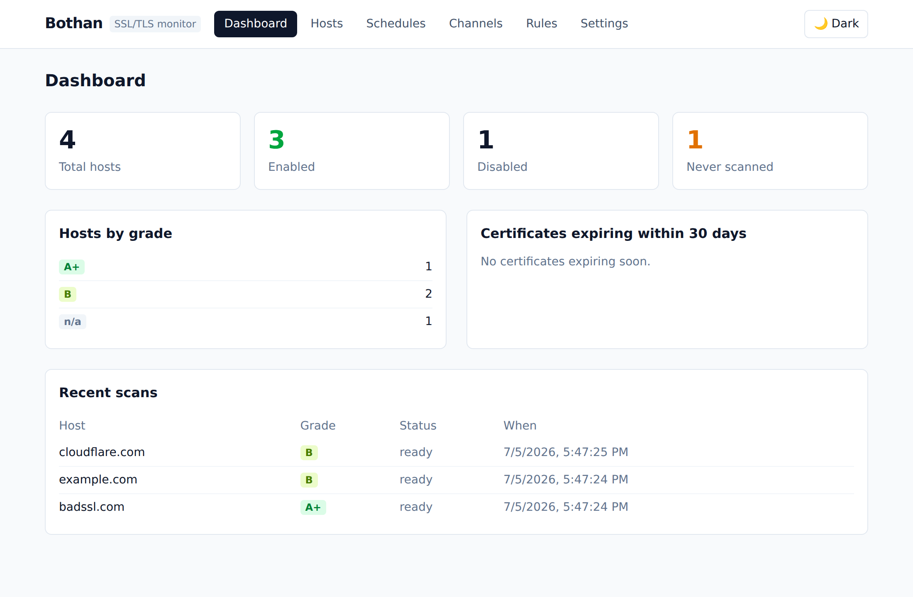
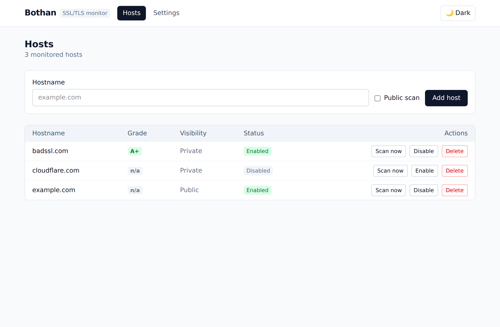
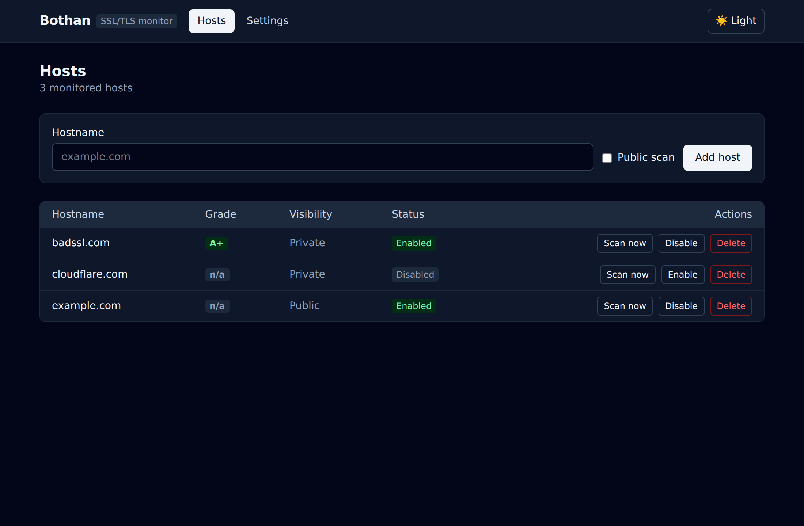
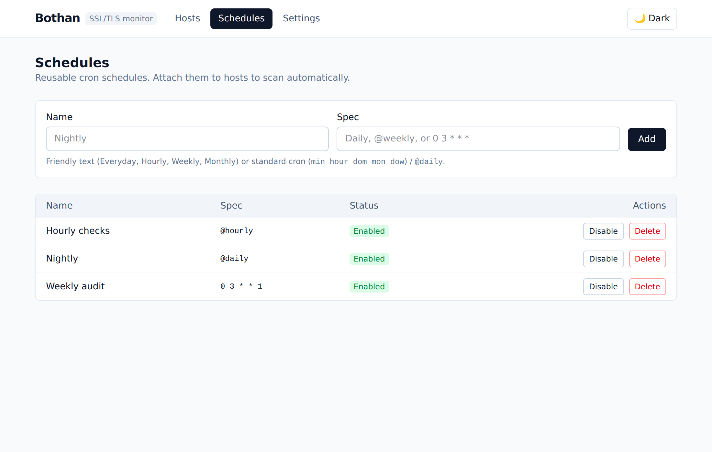
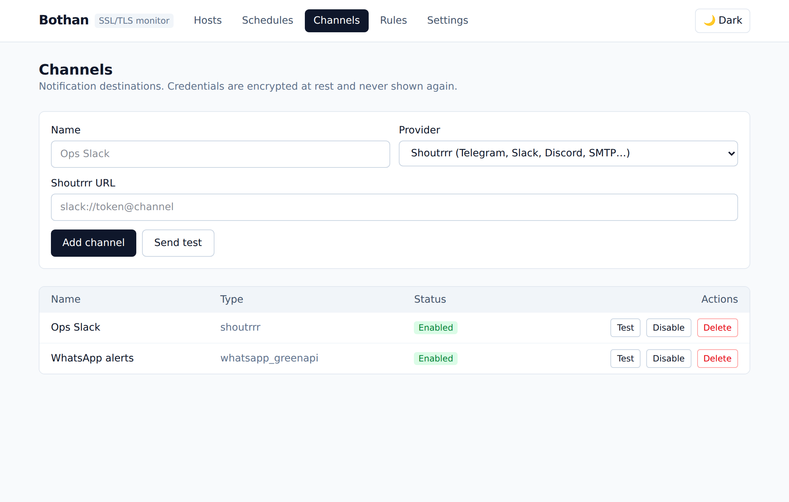
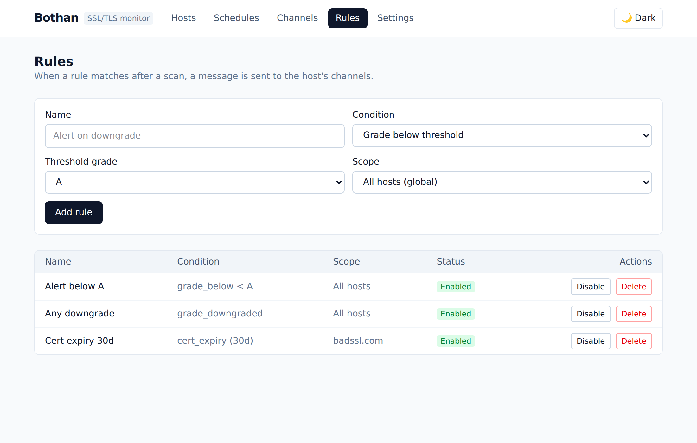
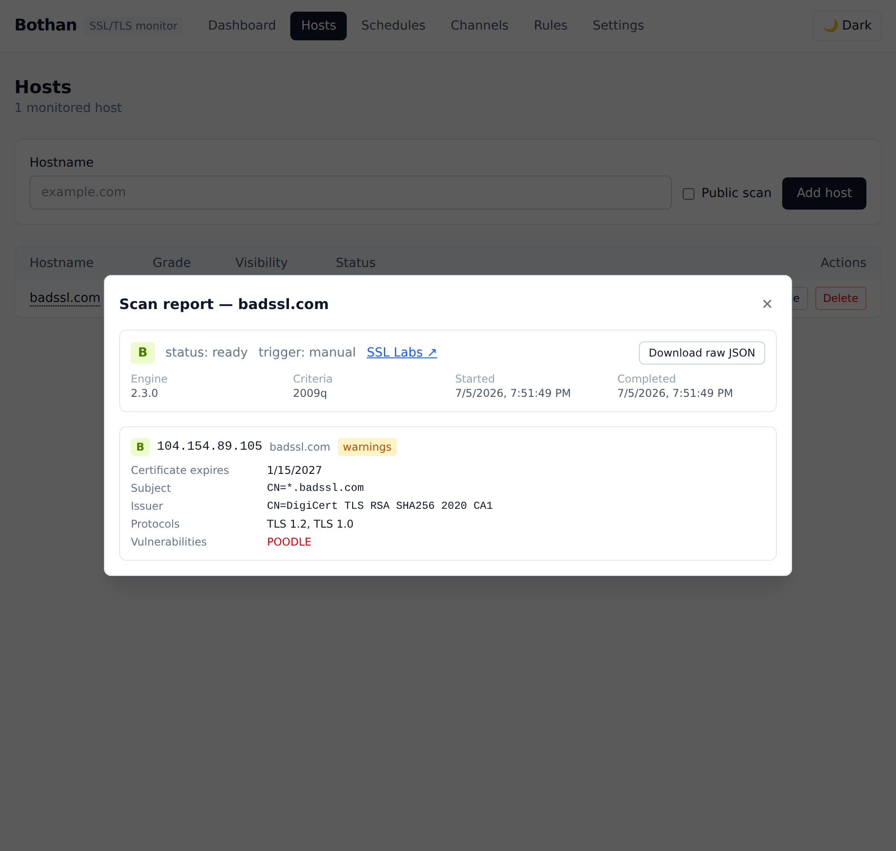
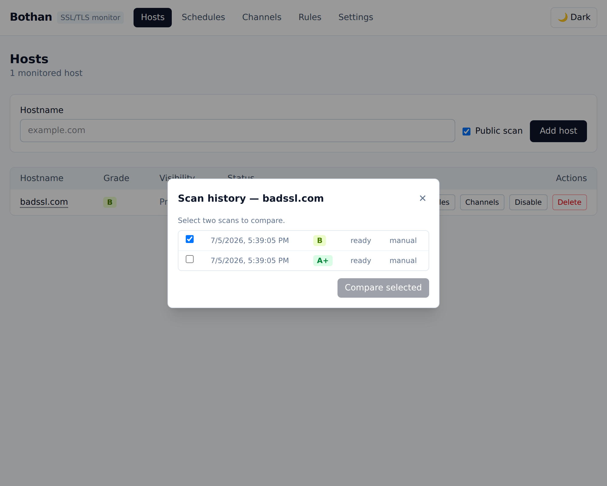
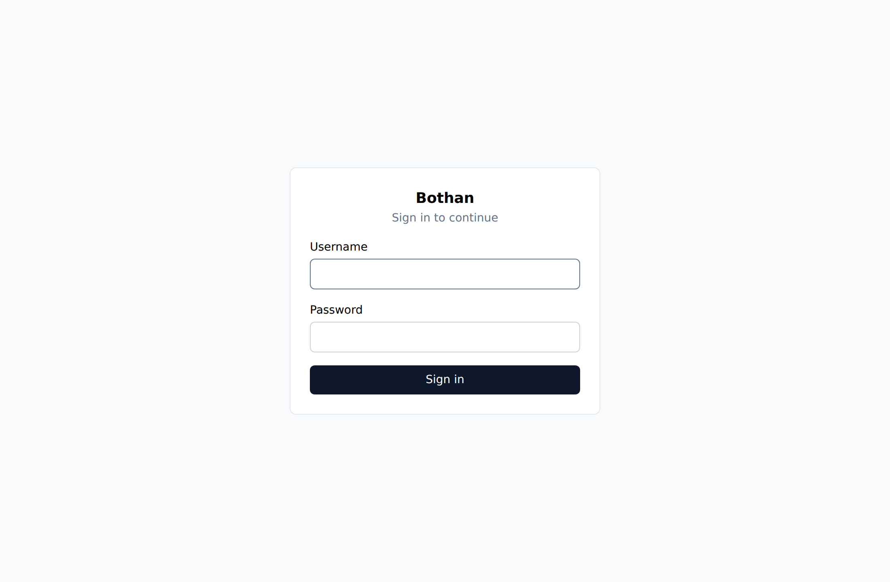
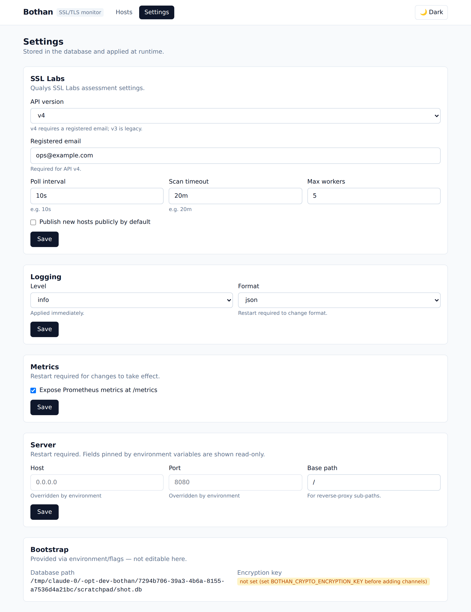

# Bothan

**Bothan** is a self-hosted service that continuously monitors the SSL/TLS
posture of your domains and websites using the [Qualys SSL Labs
API](https://www.ssllabs.com/), tracks grade history, compares scans over time,
and alerts you through multiple notification channels when something changes.

Bothan runs as a **single static binary** (or a ~17 MB `scratch` Docker image):
a **dashboard**, monitored **hosts**, **SSL Labs assessments**, cron
**scheduling**, **notifications** (Shoutrrr, GreenAPI, WhatsApp) driven by a
rules engine with credentials encrypted at rest, scan **comparison**, portable
**config export/import**, **optional authentication** (login + scoped API
tokens), a full **Prometheus** metric set with an example Grafana dashboard, and
an embedded React web UI — all with no external dependencies beyond the SSL Labs
API.

## What works today

- Single static binary (`bothan`), CGO-free.
- Runtime configuration in the database, edited from the Settings page (no YAML);
  only the DB path and encryption key come from env/flags.
- SQLite database (pure-Go `modernc.org/sqlite`) with embedded, versioned
  migrations applied at startup.
- **Host management** — add, list, edit, enable/disable, and delete monitored
  hostnames (with per-host public/private, cache, and mismatch options),
  through both the REST API and the web UI.
- HTTP server (chi) with:
  - `GET /healthz` — liveness.
  - `GET /readyz` — readiness (checks the database).
  - `GET /metrics` — Prometheus metrics.
  - `/api/v1/hosts` — host CRUD (JSON error envelope).
  - Embedded React single-page app served at `/` with client-side-route
    fallback and light/dark themes.
- Structured logging via `log/slog` (JSON or text, configurable level).
- Graceful shutdown on `SIGINT` / `SIGTERM`.

## Running

### Docker (recommended)

```bash
docker run -d --name bothan -p 8080:8080 \
  -v bothan-data:/data \
  -e BOTHAN_CRYPTO_ENCRYPTION_KEY="$(openssl rand -base64 32)" \
  techblog/bothan:latest
```

Or with Compose (`docker-compose.yml` is included):

```bash
BOTHAN_CRYPTO_ENCRYPTION_KEY="$(openssl rand -base64 32)" docker compose up -d
```

The image is built `FROM scratch` and published multi-arch for
`linux/amd64`, `linux/arm64`, and `linux/arm/v7`.

### Binary

Download a release archive for your OS/arch from the
[releases page](https://github.com/t0mer/bothan/releases), or build it:

```bash
cd web && npm ci && npm run build && cd ..   # build the embedded UI
go build -o bothan ./cmd/bothan

./bothan --db-path ./bothan.db               # everything else is set in the UI
```

Open the web UI at the bound address, then configure SSL Labs, logging, and the
rest from the **Settings** page.

### Bootstrap environment

| Variable | Purpose |
|---|---|
| `BOTHAN_DATABASE_PATH` | SQLite path (default `/data/bothan.db`). |
| `BOTHAN_CRYPTO_ENCRYPTION_KEY` | 32-byte AES key; **required once channels exist**. Keep it stable and backed up. |
| `BOTHAN_SERVER_HOST` / `BOTHAN_SERVER_PORT` | Optional bind override. |
| `BOTHAN_AUTH_INITIAL_ADMIN_USER` / `_PASSWORD` | Seed the first admin (used only on first boot). |
| `BOTHAN_SSLLABS_BASE_URL` | Point at a self-hosted/mock SSL Labs endpoint. |

## Screenshots

### Dashboard


### Hosts (light)


### Hosts (dark)


### Schedules


### Channels


### Rules


## Dashboard API

`GET /api/v1/dashboard/summary` returns total/enabled/disabled host counts, the
number never scanned, the grade distribution (hosts at each grade by latest
ready scan), certificates expiring within a window (`cert_days`, default 30),
and recent scans (`recent`, default 10).

## Host API

| Method | Path | Description |
|---|---|---|
| `GET` | `/api/v1/hosts` | List hosts (ordered by hostname). |
| `POST` | `/api/v1/hosts` | Create a host. Body: `{ "hostname", "publish?", "ignore_mismatch?", "from_cache?", "max_age_hours?", "notes?" }`. Defaults: `enabled=true`, `publish=false` (private). |
| `GET` | `/api/v1/hosts/{id}` | Get a host. |
| `PUT` | `/api/v1/hosts/{id}` | Update a host. |
| `DELETE` | `/api/v1/hosts/{id}` | Delete a host (cascades to its scans). |
| `POST` | `/api/v1/hosts/{id}/enable` | Enable scanning for a host. |
| `POST` | `/api/v1/hosts/{id}/disable` | Disable scanning without deleting. |
| `POST` | `/api/v1/hosts/{id}/scan` | Trigger a manual SSL Labs scan (202 Accepted). |
| `GET` | `/api/v1/hosts/{id}/scans` | Scan history for a host. |
| `GET` | `/api/v1/hosts/{id}/schedules` | Schedules linked to a host. |
| `PUT` | `/api/v1/hosts/{id}/schedules` | Set linked schedule ids (`{ "ids": [...] }`). |

## Schedule API

| Method | Path | Description |
|---|---|---|
| `GET` | `/api/v1/schedules` | List schedules. |
| `POST` | `/api/v1/schedules` | Create a schedule (`{ "name", "spec", "enabled?" }`). |
| `GET` | `/api/v1/schedules/{id}` | Get a schedule. |
| `PUT` | `/api/v1/schedules/{id}` | Update a schedule. |
| `DELETE` | `/api/v1/schedules/{id}` | Delete a schedule. |

Schedule `spec` accepts standard 5-field cron (`0 3 * * *`), cron descriptors
(`@hourly`, `@daily`, `@weekly`, `@monthly`), or friendly text (`Everyday`,
`Hourly`, `Weekly`, `Monthly`), normalized on save. A schedule firing enqueues a
scan for every **enabled** host linked to it; disabled hosts and disabled
schedules never enqueue, and a host with a scan already in progress is skipped.

## Scan API

| Method | Path | Description |
|---|---|---|
| `GET` | `/api/v1/scans/{id}` | Scan detail with per-endpoint grades and cert expiry. |
| `GET` | `/api/v1/scans/{id}/raw` | Full raw SSL Labs Host JSON for the scan. |
| `GET` | `/api/v1/scans/compare?from=&to=` | Structured diff of two scans of the same host. |

Every scan stores the **complete** raw SSL Labs Host object (`all=done`), so the
full report is always available — not just the grade. In the UI, click a
hostname to open its scan history; each scan has a **Report** button that opens
the full report (per-endpoint grades, warnings, certificate subject/issuer/
expiry, supported protocols, and detected vulnerabilities) with a **Download raw
JSON** action. `GET /scans/{id}` returns the structured detail and
`GET /scans/{id}/raw` the complete raw payload.

Comparison matches endpoints by IP and reports overall/per-endpoint grade
changes, certificate changes (subject/issuer/expiry), and added/removed
protocols and vulnerability flags — pick two scans in the history dialog to
compare.

### Full scan report


### Scan history


## Notifications

Channels are notification destinations; their provider config is **AES-256-GCM
encrypted at rest** with the instance key and never returned by the API. A rules
engine runs after each scan and, for every matched rule, sends a message to the
host's enabled channels. Conditions: `grade_below`, `grade_changed`,
`grade_downgraded`, `grade_improved`, `cert_expiry`, `scan_failed`,
`vuln_detected`, `scan_completed`. Repeat `grade_below` alerts are suppressed
while the failing grade is unchanged and re-fire on change.

| Method | Path | Description |
|---|---|---|
| `GET/POST` | `/api/v1/channels` | List / create channels. |
| `GET/PUT/DELETE` | `/api/v1/channels/{id}` | Get / update / delete a channel. |
| `POST` | `/api/v1/channels/{id}/test` | Send a test message using stored config. |
| `POST` | `/api/v1/channels/test` | Send a test using config in the body (pre-save). |
| `GET/PUT` | `/api/v1/hosts/{id}/channels` | Get / set a host's linked channels. |
| `GET/POST` | `/api/v1/rules` | List / create rules (global or per-host). |
| `GET/PUT/DELETE` | `/api/v1/rules/{id}` | Get / update / delete a rule. |
| `GET` | `/api/v1/hosts/{id}/rules` | Rules attached to a host. |

Channel providers: `shoutrrr` (one URL covering Telegram/Slack/Discord/SMTP/…),
`whatsapp_greenapi` (GreenAPI cloud), and `whatsapp_multidevice` (self-hosted
go-whatsapp-web-multidevice). The encryption key is required once any channel
exists — set `BOTHAN_CRYPTO_ENCRYPTION_KEY` and keep it stable.

## Configuration export / import

Back up your setup or migrate between instances via a versioned JSON bundle of
hosts, schedules, channels, rules, and their links (referenced by natural key).
**Scan history, the encryption key, session secret, users, and API tokens are
never exported.**

| Method | Path | Description |
|---|---|---|
| `GET` | `/api/v1/config/export` | Export without secrets (`secret_encryption=none`). |
| `POST` | `/api/v1/config/export` | Export with secrets: body `{ "secret_encryption": "instance_key"｜"passphrase", "passphrase?" }`. |
| `POST` | `/api/v1/config/import` | Import a bundle. Query: `mode=merge｜replace`, `dry_run=true｜false`, `passphrase?`. |

Secret modes:
- **`none`** (default): channels import **disabled** and flagged `needs_credentials`.
- **`instance_key`**: carries the AES ciphertext as-is plus a non-reversible key
  fingerprint; import verifies the destination key matches before applying. Use
  for backups and same-owner migrations with a shared, env-provisioned key.
- **`passphrase`**: re-encrypts channel secrets under an argon2id-derived key;
  import re-encrypts them with the destination instance key. Use when the two
  instances run different keys.

Import is transactional and all-or-nothing. `merge` upserts by natural key;
`replace` wipes schedules, channels, and rules first (hosts are upserted so
**scan history is preserved**). `dry_run=true` validates and reports what would
change without applying. Manage all of this from **Settings → Backup / Migrate**.

## Authentication (optional)

Authentication is **off by default** (the app is fully open). Enable it under
**Settings → Authentication**. When enabled:

- **UI** login with an argon2id-hashed password → a signed, HTTP-only session
  cookie. Seed the first admin on first boot with
  `BOTHAN_AUTH_INITIAL_ADMIN_USER` / `BOTHAN_AUTH_INITIAL_ADMIN_PASSWORD`.
- **API** access via bearer tokens (`Authorization: Bearer <token>`). Only the
  SHA-256 hash is stored; the plaintext is shown once at creation. Tokens carry
  scopes (`read` < `write` < `admin`) and an optional expiry.
- `/healthz` and `/readyz` stay open; `/metrics` stays open unless
  **protect metrics** is also enabled.

| Method | Path | Description |
|---|---|---|
| `POST` | `/api/v1/auth/login` | Log in (`{username, password}`) → session cookie. |
| `POST` | `/api/v1/auth/logout` | Clear the session. |
| `GET` | `/api/v1/auth/me` | Current auth status / principal. |
| `GET/POST` | `/api/v1/tokens` | List / create API tokens (admin). |
| `DELETE` | `/api/v1/tokens/{id}` | Revoke a token (admin). |

Required scope per request: reads need `read`, mutations need `write`, and token
and config administration need `admin`. Session logins have full access.

### Login


## SSL Labs API

| Method | Path | Description |
|---|---|---|
| `GET` | `/api/v1/ssllabs/info` | Engine/criteria version, capacity, and registration status. |
| `POST` | `/api/v1/ssllabs/register` | One-time v4 email registration (`{name, email, organization}`); persists the email. |

Bothan targets SSL Labs **API v4** by default (which requires a registered
email; register from the API or Settings) and supports **v3** as a legacy
fallback that needs no registration. The overall host grade is the lowest-ranked
grade across its endpoints. Polling, rate-limit back-off (429/503/529/500),
concurrency, and cool-off follow the SSL Labs guidelines. Set
`BOTHAN_SSLLABS_BASE_URL` to point at a self-hosted or mock endpoint.

## Settings

Bothan has **no YAML configuration file**. Almost all configuration — server
bind, logging, SSL Labs (API version, registered email, poll interval, workers,
scan timeout, default publish), and metrics — is stored in the database and
edited at runtime from the **Settings** page (or the settings API). Changes to
SSL Labs settings and the log level apply immediately; server bind, log format,
and metrics enablement take effect on restart.

### Settings page


### Settings API

| Method | Path | Description |
|---|---|---|
| `GET` | `/api/v1/settings` | Current effective settings. The encryption key is reported only as `encryption_key_set` — never returned. |
| `PUT` | `/api/v1/settings` | Update a partial set of settings (validated, all-or-nothing). |

### Bootstrap (environment/flags only)

Two things cannot live in the database and are provided at startup: the database
path (needed to open the DB) and the encryption key (storing the master key
inside the store it protects would defeat encryption-at-rest). An optional
server-bind override lets a container pin its address regardless of the stored
value.

| Flag | Env | Description |
|---|---|---|
| `--db-path` | `BOTHAN_DATABASE_PATH` | SQLite database path (default `/data/bothan.db`). |
| `--encryption-key` | `BOTHAN_CRYPTO_ENCRYPTION_KEY` | AES-256-GCM key. Prefer the env var; never stored in the DB. Keep it stable and backed up. |
| `--host` | `BOTHAN_SERVER_HOST` | Optional bind host override (wins over the stored value). |
| `--port` | `BOTHAN_SERVER_PORT` | Optional bind port override (wins over the stored value). |
| `--version` | — | Print the version and exit. |

Bootstrap precedence is **flags > environment > default**.

## Frontend development

The web UI lives in `web/` (React + Vite + TypeScript + Tailwind). The build
output is written to `internal/web/dist` and embedded into the binary via
`go:embed`.

```bash
cd web
npm install
npm run dev      # hot-reload dev server, proxies /api to localhost:8080
npm run build    # production build -> internal/web/dist (embedded on next go build)
```

## Metrics & Grafana

Prometheus metrics are exposed at `/metrics` under the `bothan_` namespace:
`hosts_total`, `hosts_by_grade`, `host_grade`, `cert_expiry_days`, `scans_total`,
`scan_duration_seconds`, `scan_queue_depth`, `ssllabs_requests_total`,
`ssllabs_capacity`, and `notifications_total`, plus the standard Go/process
collectors. An example dashboard is in
[`docs/grafana/bothan-dashboard.json`](docs/grafana/bothan-dashboard.json).

When auth is enabled, `/metrics` stays open unless **protect metrics** is also
enabled.

## Building & releasing

- **CI** (`.github/workflows/ci.yml`) runs `go vet`, build, `go test -race`, and
  a security suite (govulncheck, gosec, gitleaks, Trivy) on every push and PR.
- **Release** (`.github/workflows/release.yml`) is a manual `workflow_dispatch`:
  it resolves a date-based `YYYY.M.PATCH` version (or takes one as input), tags
  it, and runs **GoReleaser** to build cross-platform archives and publish a
  GitHub Release.
- **Docker** (`.github/workflows/docker.yml`) builds and pushes the multi-arch
  `techblog/bothan` image to Docker Hub.

## License

Apache-2.0. See [`LICENSE`](LICENSE).
