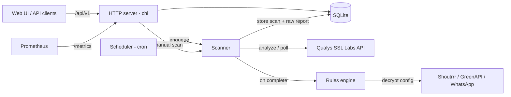

# Bothan

[](https://github.com/t0mer/bothan/actions/workflows/ci.yml)
[](https://hub.docker.com/r/techblog/bothan)
[](LICENSE)

**Bothan** is a self-hosted service that continuously monitors the SSL/TLS
posture of your domains and websites using the [Qualys SSL Labs
API](https://www.ssllabs.com/). It tracks grade history, compares scans over
time, and alerts you through multiple notification channels when something
changes.

Bothan runs as a **single static binary** (or a small `scratch` Docker image)
that bundles a **dashboard**, monitored **hosts**, **SSL Labs assessments**,
cron **scheduling**, **notifications** (Shoutrrr, GreenAPI, WhatsApp) driven by
a rules engine with credentials encrypted at rest, scan **comparison**, portable
**config export/import**, **optional authentication** (login + scoped API
tokens), a full **Prometheus** metric set with an example Grafana dashboard, and
an embedded React web UI. It has no external dependencies beyond the SSL Labs
API.

## Table of contents

- [Features](#features)
- [Screenshots](#screenshots)
- [How it works](#how-it-works)
- [Requirements](#requirements)
- [Installation](#installation)
- [Configuration](#configuration)
- [Usage](#usage)
- [API reference](#api-reference)
- [Notifications](#notifications)
- [Configuration export / import](#configuration-export--import)
- [Authentication (optional)](#authentication-optional)
- [Metrics & Grafana](#metrics--grafana)
- [Security notes](#security-notes)
- [Troubleshooting](#troubleshooting)
- [Development](#development)
- [Building & releasing](#building--releasing)
- [Contributing](#contributing)
- [License](#license)

## Features

- Single static binary (`bothan`), CGO-free.
- Runtime configuration stored in the database and edited from the Settings
  page (no YAML). Only the DB path, encryption key, and a few bootstrap values
  come from environment variables or flags.
- SQLite database (pure-Go `modernc.org/sqlite`) with embedded, versioned
  migrations applied at startup.
- **Host management**: add, list, edit, enable/disable, and delete monitored
  hostnames (with per-host public/private, cache, and mismatch options),
  through both the REST API and the web UI.
- **SSL Labs assessments** via API v4 (default) or v3, with polling, rate-limit
  back-off, and capacity/cool-off handling. The complete raw SSL Labs report is
  stored for every scan.
- **Scheduling**: cron, cron descriptors, or friendly text (`Everyday`,
  `Hourly`, …), linked to any set of hosts.
- **Scan history and comparison**: structured diff of grades, certificates,
  protocols, and vulnerabilities between two scans.
- **Notifications**: Shoutrrr (Telegram, Slack, Discord, SMTP, …), WhatsApp via
  GreenAPI, and self-hosted WhatsApp (go-whatsapp-web-multidevice), triggered by
  a rules engine. Channel credentials are AES-256-GCM encrypted at rest.
- **Configuration export/import** as a versioned JSON bundle, with optional
  secret carry-over (instance key or passphrase).
- **Optional authentication**: UI login (argon2id) and scoped API tokens.
- **Prometheus metrics** under the `bothan_` namespace, plus an example Grafana
  dashboard.
- HTTP server (chi) with `GET /healthz` (liveness), `GET /readyz` (readiness,
  checks the database), `GET /metrics`, the `/api/v1` REST API (JSON error
  envelope), and the embedded React single-page app served at `/` with
  client-side-route fallback and light/dark themes.
- Structured logging via `log/slog` (JSON or text, configurable level; the level
  can change at runtime).
- Graceful shutdown on `SIGINT` / `SIGTERM` (waits for in-flight scans), and
  scans left pending/running by a previous process are resumed on startup.

## Screenshots

### Dashboard


### Dashboard (dark)


### Hosts (light)


### Hosts (dark)


### Schedules


### Channels


### Rules


### Full scan report


### Scan history


### Settings page


### Login


<!-- TODO: screenshot of the Tokens page (shown only when authentication is enabled) -->

## How it works


```mermaid
flowchart LR
    UI[Web UI / API clients] -->|/api/v1| API[HTTP server - chi]
    API --> DB[(SQLite)]
    Sched[Scheduler - cron] -->|enqueue| Scanner
    API -->|manual scan| Scanner
    Scanner -->|analyze / poll| SSLLabs[Qualys SSL Labs API]
    Scanner -->|store scan + raw report| DB
    Scanner -->|on complete| Rules[Rules engine]
    Rules -->|decrypt config| Channels[Shoutrrr / GreenAPI / WhatsApp]
    Prom[Prometheus] -->|/metrics| API
```

1. You add **hosts** and link them to **schedules** (or trigger a scan
   manually).
2. The **scanner** waits for free SSL Labs capacity (honouring the cool-off
   between new assessments), starts an assessment, polls it until it finishes
   or times out, and stores the per-endpoint results plus the complete raw SSL
   Labs report. A host already being scanned is never scanned twice at once.
3. The overall host grade is the **lowest** grade across its endpoints.
4. After each scan the **rules engine** evaluates global and host-specific rules
   and sends a message to every enabled channel linked to that host.
5. The dashboard, scan history, comparison, and Prometheus metrics are all
   derived from the stored scans.

## Requirements

- Outbound HTTPS access to `api.ssllabs.com` (or your own endpoint via
  `BOTHAN_SSLLABS_BASE_URL`).
- For SSL Labs **API v4** (the default): a one-time email registration with
  SSL Labs, done from Settings or the API. API v3 needs no registration.
- A 32-byte encryption key (`BOTHAN_CRYPTO_ENCRYPTION_KEY`) before you create
  notification channels.
- Docker, **or** a release binary, **or** Go 1.25+ and Node.js 20 to build from
  source.

## Installation

### Docker (recommended)

Multi-arch images (`linux/amd64`, `linux/arm64`, `linux/arm/v7`) are published
to Docker Hub as [`techblog/bothan`](https://hub.docker.com/r/techblog/bothan)
with `latest` and `YYYY.M.PATCH` version tags.

```bash
KEY="$(openssl rand -base64 32)"
echo "$KEY"   # save this key somewhere safe

docker run -d --name bothan -p 8080:8080 \
  -v bothan-data:/data \
  -e BOTHAN_CRYPTO_ENCRYPTION_KEY="$KEY" \
  techblog/bothan:latest
```

You need the same key on every restart. If you re-create the container with a
new key, existing channel configs can no longer be decrypted (see
[Security notes](#security-notes)).

The image is built `FROM scratch`, stores its database at `/data/bothan.db`
(declared as a volume), and exposes port `8080`.

### Docker Compose

A [`docker-compose.yml`](docker-compose.yml) is included. It uses a named volume
for `/data` and reads the key from your shell or an `.env` file:

```bash
export BOTHAN_CRYPTO_ENCRYPTION_KEY="$(openssl rand -base64 32)"   # store it safely
docker compose up -d
```

Uncomment `BOTHAN_AUTH_INITIAL_ADMIN_USER` / `BOTHAN_AUTH_INITIAL_ADMIN_PASSWORD`
in the Compose file to seed the first admin user.

### Binary

The Release workflow publishes cross-platform archives on the
[releases page](https://github.com/t0mer/bothan/releases) (Linux
amd64/arm64/armv6/armv7/386, macOS amd64/arm64, Windows amd64/arm64). No GitHub release has
been published yet, so build from source for now.

```bash
./bothan --db-path ./bothan.db               # everything else is set in the UI
```

### Build from source

```bash
git clone https://github.com/t0mer/bothan.git && cd bothan
cd web && npm ci && npm run build && cd ..   # build the embedded UI
go build -o bothan ./cmd/bothan

./bothan --db-path ./bothan.db
```

Or build the Docker image locally:

```bash
docker build -t bothan:local .
```

After startup, open the web UI at the bound address (default
`http://localhost:8080`) and configure SSL Labs, logging, and the rest from the
**Settings** page.

## Configuration

Bothan has **no YAML configuration file**. Configuration comes from two places:

1. **Bootstrap values** (flags / environment): the values needed to open the
   database or that must never be stored in it.
2. **Runtime settings** (database): everything else, edited from the Settings
   page or the settings API.

### Bootstrap (flags and environment)

The database path is needed to open the DB, and the encryption key cannot be
stored inside the store it protects. An optional server-bind override lets a
container pin its address regardless of the stored value.

| Flag | Environment variable | Default | Description |
|---|---|---|---|
| `--db-path` | `BOTHAN_DATABASE_PATH` | `/data/bothan.db` | SQLite database path. |
| `--encryption-key` | `BOTHAN_CRYPTO_ENCRYPTION_KEY` | _(unset)_ | AES-256-GCM key: 32 bytes as base64, hex, or a raw 32-character string. **Required once channels exist.** Prefer the env var; never stored in the DB. Keep it stable and backed up. |
| `--host` | `BOTHAN_SERVER_HOST` | _(stored setting)_ | Optional bind host override (wins over the stored value). |
| `--port` | `BOTHAN_SERVER_PORT` | _(stored setting)_ | Optional bind port override (wins over the stored value). |
| — | `BOTHAN_SSLLABS_BASE_URL` | _(SSL Labs default for the API version)_ | Point at a self-hosted or mock SSL Labs endpoint. |
| — | `BOTHAN_AUTH_INITIAL_ADMIN_USER` | _(unset)_ | Username of the first admin, created on boot only when no users exist. |
| — | `BOTHAN_AUTH_INITIAL_ADMIN_PASSWORD` | _(unset)_ | Password of the first admin (both user and password must be set). |
| `--version` | — | — | Print the version and exit. |
| `--help` | — | — | Print usage and exit. |

Bootstrap precedence is **flags > environment > default**. An empty environment
variable counts as unset.

### Runtime settings (database)

Stored in the `settings` table, seeded with defaults on first start, and edited
from **Settings** or `PUT /api/v1/settings`. Updates are validated and applied
all-or-nothing.

| Section | Key | Default | Description | Applies |
|---|---|---|---|---|
| Server | `server.host` | `0.0.0.0` | HTTP bind host. | On restart |
| Server | `server.port` | `8080` | HTTP bind port (1–65535). | On restart |
| Server | `server.base_path` | `/` | Reverse-proxy sub-path prefix stripped from incoming requests. Sub-path hosting works for the API only: the bundled web UI uses root-absolute paths (`/api/v1`, `/assets`) and does not work under a non-root base path. | On restart |
| Log | `log.level` | `info` | `debug`, `info`, `warn`, or `error`. | Immediately |
| Log | `log.format` | `json` | `json` or `text`. | On restart |
| SSL Labs | `ssllabs.api_version` | `v4` | `v4` (requires a registered email) or `v3`. | Immediately |
| SSL Labs | `ssllabs.email` | _(empty)_ | Registered SSL Labs email (set by registration). | Immediately |
| SSL Labs | `ssllabs.poll_interval` | `10s` | How often a running assessment is polled (Go duration). | Immediately |
| SSL Labs | `ssllabs.max_workers` | `5` | Stored and validated (≥ 1) but not currently enforced; the scanner runs at most 16 scans at once. | Not enforced |
| SSL Labs | `ssllabs.scan_timeout` | `20m` | Maximum wall-clock time per scan (Go duration). | Immediately |
| SSL Labs | `ssllabs.default_publish` | `false` | Default SSL Labs "publish" flag for new hosts (`false` = private). | Immediately |
| Metrics | `metrics.enabled` | `true` | Serve `/metrics`. | On restart |
| Auth | `auth.enabled` | `false` | Require login / API token for the API and UI. | Immediately |
| Auth | `auth.protect_metrics` | `false` | Also require authentication on `/metrics`. | Immediately |

A random session-signing secret (`auth.session_secret`) is generated on first
start; it is never returned by the API or exported. `GET /api/v1/settings` also
reports the database path, whether the encryption key is set
(`encryption_key_set`), and which bind values are overridden by flags/env
(`env_overridden`).

## Usage

### Web UI walkthrough

- **Dashboard**: host counts, grade distribution, certificates expiring soon,
  and recent scans.
- **Hosts**: add hostnames (bare host, no scheme, port, or path), toggle them,
  click **Scan** to run a manual assessment, and link each host to schedules and
  notification channels. Click a hostname to open its scan history.
- **Scan history**: each scan has a **Report** button that opens the full report
  (per-endpoint grades, warnings, certificate subject/issuer/expiry, supported
  protocols, and detected vulnerabilities) with a **Download raw JSON** action.
  Pick two scans to compare them.
- **Schedules**: create cron schedules and link hosts to them.
- **Channels**: add notification destinations and send a test message before
  saving.
- **Rules**: define when to notify (global or per-host).
- **Tokens** (only when authentication is enabled): create and revoke API
  tokens.
- **Settings**: server, logging, SSL Labs (including v4 registration), metrics,
  authentication, and **Backup / Migrate**.
- A light/dark theme toggle is in the navigation bar.

### Typical first run

1. Start Bothan with an encryption key (see [Installation](#installation)).
2. In **Settings → SSL Labs**, register an email for API v4 (or switch to v3).
3. Add hosts on the **Hosts** page and trigger a first scan.
4. Create a schedule (e.g. `@daily`) and link your hosts to it.
5. Add a channel, link it to the hosts, and create rules such as
   `grade_below B` or `cert_expiry 30`.

### Schedules

Schedule `spec` accepts standard 5-field cron (`0 3 * * *`), cron descriptors
(`@hourly`, `@daily`, `@weekly`, `@monthly`), or friendly text (`Everyday`,
`Daily`, `Hourly`, `Weekly`, `Monthly`, case-insensitive), normalized on save. A
schedule firing enqueues a scan for every **enabled** host linked to it;
disabled hosts and disabled schedules never enqueue, and a host with a scan
already in progress is skipped.

### Scans and comparison

Every scan stores the **complete** raw SSL Labs Host object (`all=done`), so the
full report is always available, not just the grade. Scan statuses are
`pending`, `running`, `ready`, and `error`.

Comparison matches endpoints by IP and reports overall/per-endpoint grade
changes, certificate changes (subject/issuer/expiry), and added/removed
protocols and vulnerability flags.

### SSL Labs API versions

Bothan targets SSL Labs **API v4** by default (which requires a registered
email; register from the API or Settings) and supports **v3** as a legacy
fallback that needs no registration. Polling, rate-limit back-off (429
exponential, 503/529 long waits, bounded retries on other 5xx), capacity
checks, and cool-off follow the SSL Labs guidelines. Grades are ranked
`A+ > A > A- > B > C > D > E > F > T/M`.

## API reference

All endpoints live under `/api/v1` and return JSON. Errors use a consistent
envelope:

```json
{ "error": { "code": "invalid", "message": "hostname is required" } }
```

When authentication is enabled, send `Authorization: Bearer <token>` or a
session cookie (see [Authentication](#authentication-optional)).

### System endpoints

| Method | Path | Description |
|---|---|---|
| `GET` | `/healthz` | Liveness: `{"status":"ok","version":...}`. |
| `GET` | `/readyz` | Readiness (pings the database): `{"status":"ready","version":...}` or 503. |
| `GET` | `/metrics` | Prometheus metrics (when `metrics.enabled`). |

### Dashboard API

`GET /api/v1/dashboard/summary` returns total/enabled/disabled host counts, the
number never scanned, the grade distribution (hosts at each grade by latest
ready scan), certificates expiring within a window (`cert_days`, default 30),
and recent scans (`recent`, default 10).

### Host API

| Method | Path | Description |
|---|---|---|
| `GET` | `/api/v1/hosts` | List hosts (ordered by hostname) with latest grade and last scan status. |
| `POST` | `/api/v1/hosts` | Create a host. Body: `{ "hostname", "enabled?", "publish?", "ignore_mismatch?", "from_cache?", "max_age_hours?", "notes?" }`. Defaults: `enabled=true`, `publish=ssllabs.default_publish` (private by default). |
| `GET` | `/api/v1/hosts/{id}` | Get a host. |
| `PUT` | `/api/v1/hosts/{id}` | Update a host. |
| `DELETE` | `/api/v1/hosts/{id}` | Delete a host (cascades to its scans). |
| `POST` | `/api/v1/hosts/{id}/enable` | Enable scanning for a host. |
| `POST` | `/api/v1/hosts/{id}/disable` | Disable scanning without deleting. |
| `POST` | `/api/v1/hosts/{id}/scan` | Trigger a manual SSL Labs scan (`202 Accepted`; `409` if a scan is already in progress). |
| `GET` | `/api/v1/hosts/{id}/scans` | Scan history for a host. |
| `GET` | `/api/v1/hosts/{id}/schedules` | Schedules linked to a host. |
| `PUT` | `/api/v1/hosts/{id}/schedules` | Set linked schedule IDs (`{ "ids": [...] }`). |
| `GET` | `/api/v1/hosts/{id}/channels` | Channels linked to a host. |
| `PUT` | `/api/v1/hosts/{id}/channels` | Set linked channel IDs (`{ "ids": [...] }`). |
| `GET` | `/api/v1/hosts/{id}/rules` | Rules attached to a host. |

`max_age_hours` is only used when `from_cache` is true and must be ≥ 1.

Example:

```bash
curl -X POST http://localhost:8080/api/v1/hosts \
  -H 'Content-Type: application/json' \
  -d '{"hostname":"example.com"}'
curl -X POST http://localhost:8080/api/v1/hosts/1/scan
```

### Schedule API

| Method | Path | Description |
|---|---|---|
| `GET` | `/api/v1/schedules` | List schedules. |
| `POST` | `/api/v1/schedules` | Create a schedule (`{ "name", "spec", "enabled?" }`). |
| `GET` | `/api/v1/schedules/{id}` | Get a schedule. |
| `PUT` | `/api/v1/schedules/{id}` | Update a schedule. |
| `DELETE` | `/api/v1/schedules/{id}` | Delete a schedule. |

### Scan API

| Method | Path | Description |
|---|---|---|
| `GET` | `/api/v1/scans/{id}` | Scan detail with per-endpoint grades and certificate expiry. |
| `GET` | `/api/v1/scans/{id}/raw` | Full raw SSL Labs Host JSON for the scan. |
| `GET` | `/api/v1/scans/compare?from=&to=` | Structured diff of two scans of the same host. |

### Notification API

| Method | Path | Description |
|---|---|---|
| `GET/POST` | `/api/v1/channels` | List / create channels (`{ "name", "type", "enabled?", "config": {...} }`). |
| `GET/PUT/DELETE` | `/api/v1/channels/{id}` | Get / update / delete a channel. |
| `POST` | `/api/v1/channels/{id}/test` | Send a test message using the stored config. |
| `POST` | `/api/v1/channels/test` | Send a test using the config in the body (before saving). |
| `GET/POST` | `/api/v1/rules` | List / create rules (global or per-host). |
| `GET/PUT/DELETE` | `/api/v1/rules/{id}` | Get / update / delete a rule. |

### Configuration API

| Method | Path | Description |
|---|---|---|
| `GET` | `/api/v1/config/export` | Export without secrets (`secret_encryption=none`). |
| `POST` | `/api/v1/config/export` | Export with secrets: body `{ "secret_encryption": "instance_key" \| "passphrase", "passphrase?" }`. |
| `POST` | `/api/v1/config/import` | Import a bundle. Query: `mode=merge\|replace`, `dry_run=true\|false`, `passphrase?`. |

### Settings API

| Method | Path | Description |
|---|---|---|
| `GET` | `/api/v1/settings` | Current effective settings. The encryption key is reported only as `encryption_key_set` and never returned. |
| `PUT` | `/api/v1/settings` | Update a partial set of settings (validated, all-or-nothing). Durations are strings, e.g. `{"ssllabs":{"poll_interval":"15s"}}`. |

### SSL Labs API

| Method | Path | Description |
|---|---|---|
| `GET` | `/api/v1/ssllabs/info` | Engine/criteria version, capacity, and registration status. |
| `POST` | `/api/v1/ssllabs/register` | One-time v4 email registration (`{name, email, organization}`); persists the email. |

### Auth and token API

| Method | Path | Description |
|---|---|---|
| `POST` | `/api/v1/auth/login` | Log in (`{username, password}`) and receive a session cookie. |
| `POST` | `/api/v1/auth/logout` | Clear the session. |
| `GET` | `/api/v1/auth/me` | Current auth status / principal. |
| `GET/POST` | `/api/v1/tokens` | List / create API tokens (`{ "name", "scopes": "read,write", "expires_in?": "720h" }`, admin). |
| `DELETE` | `/api/v1/tokens/{id}` | Revoke a token (admin). |

## Notifications

Channels are notification destinations. Their provider config is **AES-256-GCM
encrypted at rest** with the instance key and never returned by the API. A rules
engine runs after each scan and, for every matched rule, sends a message to the
**enabled channels linked to that host**. A host without linked channels
receives no notifications.

### Channel providers

| `type` | Provider | `config` fields |
|---|---|---|
| `shoutrrr` | [Shoutrrr](https://containrrr.dev/shoutrrr/): one URL covering Telegram, Slack, Discord, SMTP, Gotify, ntfy, … | `url` |
| `whatsapp_greenapi` | GreenAPI (WhatsApp cloud) | `instance_id`, `token`, `phone` (digits, international format; `@c.us` is appended automatically), `api_url` (optional, default `https://api.green-api.com`) |
| `whatsapp_multidevice` | Self-hosted [go-whatsapp-web-multidevice](https://github.com/aldinokemal/go-whatsapp-web-multidevice) | `base_url`, `phone`, `username` / `password` (optional Basic Auth) |

The encryption key is required to create a channel and to send notifications.
Set `BOTHAN_CRYPTO_ENCRYPTION_KEY` and keep it stable.

### Rule conditions

Rules are either global (no `host_id`) or attached to a single host.

| `condition_type` | Fires when |
|---|---|
| `grade_below` | The overall grade is below `threshold_grade`. Repeat alerts are suppressed while the failing grade is unchanged and re-fire when it changes. |
| `grade_changed` | The grade differs from the previous ready scan. |
| `grade_downgraded` | The grade is worse than the previous ready scan. |
| `grade_improved` | The grade is better than the previous ready scan. |
| `cert_expiry` | Any endpoint certificate expires within `expiry_days` (default 30). |
| `vuln_detected` | SSL Labs reports at least one vulnerability. |
| `scan_failed` | The scan ended in error. |
| `scan_completed` | The scan finished successfully. |

Sending is best-effort: failures are logged and counted in
`bothan_notifications_total{result="failed"}` without affecting the scan.

## Configuration export / import

Back up your setup or migrate between instances via a versioned JSON bundle of
hosts, schedules, channels, rules, and their links (referenced by natural key).
**Scan history, the encryption key, session secret, users, and API tokens are
never exported.**

Secret modes:
- **`none`** (default): channels import **disabled** and flagged
  `needs_credentials`.
- **`instance_key`**: carries the AES ciphertext as-is plus a non-reversible key
  fingerprint; import verifies the destination key matches before applying. Use
  for backups and same-owner migrations with a shared, env-provisioned key.
- **`passphrase`**: re-encrypts channel secrets under an argon2id-derived key;
  import re-encrypts them with the destination instance key. Use when the two
  instances run different keys.

Import is transactional and all-or-nothing. `merge` upserts by natural key;
`replace` wipes schedules, channels, and rules first (hosts are upserted so
**scan history is preserved**). `dry_run=true` validates and reports what would
change without applying. Manage all of this from **Settings → Backup / Migrate**
or the [Configuration API](#configuration-api).

## Authentication (optional)

Authentication is **off by default** (the app is fully open). Enable it under
**Settings → Authentication**. When enabled:

- **UI** login with an argon2id-hashed password returns a signed, HTTP-only
  session cookie (`bothan_session`, valid for 24 hours). Seed the first admin on
  first boot with `BOTHAN_AUTH_INITIAL_ADMIN_USER` /
  `BOTHAN_AUTH_INITIAL_ADMIN_PASSWORD`. There is no user-management UI; the
  seeded admin is the only account.
- **API** access via bearer tokens (`Authorization: Bearer <token>`). Tokens are
  prefixed `bth_`; only the SHA-256 hash is stored and the plaintext is shown
  once at creation. Tokens carry scopes (`read` < `write` < `admin`) and an
  optional expiry.
- `/healthz` and `/readyz` stay open; `/metrics` stays open unless
  **protect metrics** is also enabled.

Required scope per request: reads need `read`, mutations need `write`, and
token, config export/import, and settings changes need `admin`. Session logins
have full access.

> **Seed an admin before enabling authentication.** Otherwise nobody can log in
> (see [Troubleshooting](#troubleshooting)).

## Metrics & Grafana

Prometheus metrics are exposed at `/metrics` under the `bothan_` namespace,
plus the standard Go/process collectors:

| Metric | Type | Labels | Description |
|---|---|---|---|
| `bothan_hosts_total` | gauge | `enabled` | Number of hosts by enabled state. |
| `bothan_hosts_by_grade` | gauge | `grade` | Hosts currently at each grade (latest ready scan). |
| `bothan_host_grade` | gauge | `host` | Numeric grade of a host's latest ready scan (A+ = 8 … F = 1, T/M = 0). |
| `bothan_cert_expiry_days` | gauge | `host` | Days until a host's earliest certificate expiry. |
| `bothan_scans_total` | counter | `status` | Scans by final status. |
| `bothan_scan_duration_seconds` | histogram | — | Scan wall-clock duration. |
| `bothan_scan_queue_depth` | gauge | — | Scans queued or in progress. |
| `bothan_ssllabs_requests_total` | counter | `status_code` | SSL Labs API requests by HTTP status code. |
| `bothan_ssllabs_capacity` | gauge | `kind` (`current`, `max`) | SSL Labs assessment capacity. |
| `bothan_notifications_total` | counter | `channel_type`, `result` | Notifications sent, by channel type and result (`sent` / `failed`). |

An example Grafana dashboard ("Bothan — SSL/TLS Posture") is in
[`docs/grafana/bothan-dashboard.json`](docs/grafana/bothan-dashboard.json). It
covers host totals, queue depth, SSL Labs capacity, hosts by grade, certificate
expiry, scan results and duration, SSL Labs request rates, and notification
results.

Example scrape config:

```yaml
scrape_configs:
  - job_name: bothan
    static_configs:
      - targets: ["bothan:8080"]
```

## Security notes

- **Encryption key**: channel credentials are encrypted with
  `BOTHAN_CRYPTO_ENCRYPTION_KEY` (AES-256-GCM). The key is never stored in the
  database. If you lose or change it, stored channels can no longer be
  decrypted. Back it up alongside the database.
- **Data at rest**: the `/data` volume holds the SQLite database (hosts, scan
  history, encrypted channel configs, password hashes, token hashes, and the
  session secret). Protect and back it up.
- **Exposure**: authentication is off by default. Enable it (and optionally
  **protect metrics**) before exposing Bothan beyond a trusted network, and
  terminate TLS at a reverse proxy.
- **Cookies behind a proxy**: the session cookie is marked `Secure` when the
  request is HTTPS or carries `X-Forwarded-Proto: https`. Make sure your proxy
  sets that header.
- **Passphrase imports** pass the passphrase as a query parameter; avoid proxies
  that log full request URLs, or import from a trusted network.
- **SSL Labs publish flag**: hosts are scanned privately by default
  (`publish=false`); enabling it makes results visible on the public SSL Labs
  boards.

## Troubleshooting

| Symptom | Cause / fix |
|---|---|
| `412 ssllabs_unregistered` when scanning | API v4 needs a registered email. Register in **Settings → SSL Labs** (or `POST /api/v1/ssllabs/register`), or switch to v3. |
| `412 no_key` when saving a channel or testing a saved one | `BOTHAN_CRYPTO_ENCRYPTION_KEY` is not set. Set it and restart. (Testing an unsaved channel with `POST /api/v1/channels/test` does not need the key.) |
| `initializing encryption: … must be 32 bytes` at startup | The key must decode to exactly 32 bytes (e.g. `openssl rand -base64 32`). |
| Notifications fail with `decrypting channel config` | The encryption key changed since the channel was saved. Restore the original key or re-enter the channel credentials. |
| `409 scan_in_progress` | A scan for that host is already pending or running; wait for it to finish. |
| No notifications although rules match | The host has no **enabled** channels linked to it (Hosts → channels). |
| Locked out after enabling authentication | No user exists. Admin seeding runs only when the users table is empty: set `BOTHAN_AUTH_INITIAL_ADMIN_USER` / `_PASSWORD` and restart. |
| Changed bind address, port, or metrics setting has no effect | These apply on restart. Flags/env (`--host`, `--port`) always win over stored values. |

## Development

The backend is Go (chi, `modernc.org/sqlite`, robfig/cron, Shoutrrr,
Prometheus client). The web UI lives in `web/` (React + Vite + TypeScript +
Tailwind). The UI build output is written to `internal/web/dist` and embedded
into the binary via `go:embed`; a placeholder `index.html` is tracked so the Go
code compiles before the first UI build.

```bash
# Frontend
cd web
npm install
npm run dev      # hot-reload dev server, proxies /api, /healthz, /readyz, /metrics to localhost:8080
npm run build    # production build -> internal/web/dist (embedded on next go build)

# Backend
go vet ./...
go test -race ./...
go build -o bothan ./cmd/bothan
./bothan --db-path ./bothan.db
```

Project layout:

```
cmd/bothan/           entry point (flags, wiring, graceful shutdown)
internal/api/         /api/v1 handlers
internal/auth/        passwords, sessions, API tokens, middleware
internal/bundle/      config export/import bundle
internal/config/      bootstrap flags/env
internal/crypto/      AES-256-GCM and passphrase encryption
internal/metrics/     Prometheus metrics and collectors
internal/model/       domain types and grade ordering
internal/notify/      rules engine and channel providers
internal/scanner/     scan orchestration, back-off, comparison
internal/scheduler/   cron schedules
internal/server/      router, middleware, system endpoints
internal/settings/    database-backed runtime settings
internal/ssllabs/     SSL Labs API v3/v4 client
internal/store/       SQLite repositories and migrations runner
internal/web/         embedded SPA
migrations/           versioned SQL migrations
web/                  React UI source
docs/grafana/         example Grafana dashboard
```

## Building & releasing

- **CI** (`.github/workflows/ci.yml`) builds the UI and runs `go vet`, build,
  `go test -race`, and a security suite (govulncheck, gosec, gitleaks, Trivy) on
  pushes and pull requests to `main`.
- **Release** (`.github/workflows/release.yml`) is a manual `workflow_dispatch`:
  it resolves a date-based `YYYY.M.PATCH` version (or takes one as input), tags
  it, and runs **GoReleaser** to build cross-platform archives and publish a
  GitHub Release.
- **Docker** (`.github/workflows/docker.yml`) builds and pushes the multi-arch
  `techblog/bothan` image to Docker Hub, either after a successful Release or on
  manual dispatch (which tags the next version after a successful push).
- **GHCR** (`.github/workflows/publish-ghcr.yml`) is a manual workflow that
  pushes the same image to `ghcr.io/t0mer/bothan`.

## Contributing

Issues and pull requests are welcome. Please run `go vet ./...`,
`go test -race ./...`, and `npm run build` in `web/` before opening a PR, and
keep changes focused.

## License

Apache-2.0. See [`LICENSE`](LICENSE).
